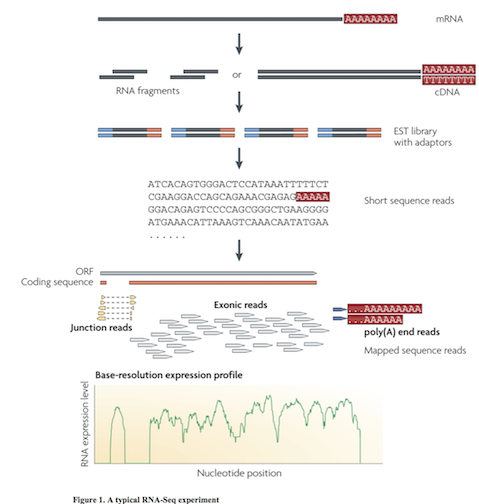
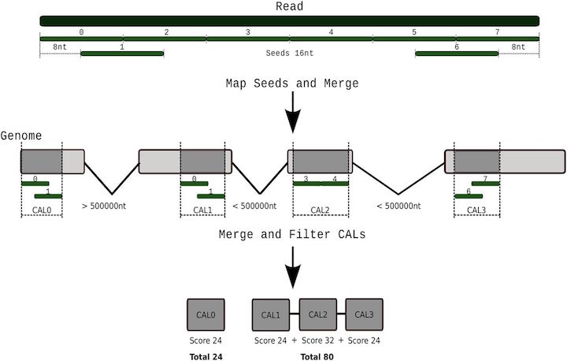

# RNASeq

Efforts to sequence the transcripts expressed in a cell or organism.

Using techniques to extract the 
Wang et al. Nat Rev Genetics. 2009. doi:[10.1038/nrg2484](http://dx.doi.org/10.1038/nrg2484)


# Multiple approaches to understanding the transcriptome

1. Genome sequenced, align RNAseq reads to genome
2. de novo Assembly of mRNA into transcripts

3. Quantify gene expression from reads aligned to genome or
transcripts

# Reads to Genome mapping

It is important to note that aligning sequences to the genome when
there are introns requires dealing with introns. So splice-aware
alignements are needed in some cases.



Tarraga et al 2017. DNA Research.[10.1093/dnares/dsv039](https://dx.doi.org/10.1093/dnares/dsv039)

#Reads to Genome mapping

Challenges: mRNA is spliced, genome contains introns

Splice-aware short read aligners. Speed and accuracy tradeoffs
* Tophat + Bowtie -- this is old don't use
* HISAT/HISAT2
* GMAP/GSNAP
* STAR

# Need to Quantify expression

* Count reads overlapping exons
* Table of total read counts per gene
* Normalize counts for gene length and sequencing library depth
* Gene expression then is FPKM - Fragments per Kilobase per Millions of reads
* Tools: htseq-count, stringtie
* BEDtools
* R tools with iRanges


# Evaluating expression differences

Statistical tools for evaluating gene expression differences

* Ballgown [bioconductor package](https://bioconductor.org/packages/release/bioc/html/ballgown.html)
* DESeq [bioconductor package](https://bioconductor.org/packages/release/bioc/html/DESeq.html)
* edgeR [bioconductor package](https://bioconductor.org/packages/release/bioc/html/edgeR.html)

# Alternative approach for Quantifying

Compare reads to __Transcripts__ instead of Genome
* Kalisto and Sailfish are common tools
* Bray et al 2016 "Near-optimal probabilistic RNA-seq quantification"
doi:[10.1038/nbt.3519](http://dx.doi.org/10.1038/nbt.3519)
* Patro et al 2014 "Sailfish enables alignment-free isoform
quantification from RNA-seq reads using lightweight algorithms" doi:[10.1038/nbt.2862](http://dx.doi.org/10.1038/nbt.2862)


# Alignment free quantification

```
Usage: kallisto quant [arguments] FASTQ-files

Required arguments:
-i, --index=STRING            Filename for the kallisto index to be used for
                              quantification
-o, --output-dir=STRING       Directory to write output to

Optional arguments:
    --bias                    Perform sequence based bias correction
-b, --bootstrap-samples=INT   Number of bootstrap samples (default: 0)
    --seed=INT                Seed for the bootstrap sampling (default: 42)
    --plaintext               Output plaintext instead of HDF5
    --fusion                  Search for fusions for Pizzly
    --single                  Quantify single-end reads
    --single-overhang         Include reads where unobserved rest of fragment is
                              predicted to lie outside a transcript
    --fr-stranded             Strand specific reads, first read forward
    --rf-stranded             Strand specific reads, first read reverse
-l, --fragment-length=DOUBLE  Estimated average fragment length
-s, --sd=DOUBLE               Estimated standard deviation of fragment length
                              (default: -l, -s values are estimated from paired
                               end data, but are required when using --single)
-t, --threads=INT             Number of threads to use (default: 1)
    --pseudobam               Save pseudoalignments to transcriptome to BAM file
    --genomebam               Project pseudoalignments to genome sorted BAM file
-g, --gtf                     GTF file for transcriptome information
                              (required for --genomebam)
-c, --chromosomes             Tab separated file with chromosome names and lengths
                              (optional for --genomebam, but recommended)

```

Note this won't quite work to copy and paste.

```bash

#!/usr/bin/bash

module load kallisto
ln -s /bigdata/gen220/shared/data-examples/rnaseq/kallisto/S_cerevisiae_ORFs.fasta
ln -s 
kallisto index -i Scer.idx S_cerevisiae_ORFs.fasta
cat samples.tsv | while read ACC COND REP
do
 OUT=output/$COND.$REP
 kallisto quant -t 8 --single -l 300 -s 20 -i Scer.idx -o $OUT data/${ACC}_1.fastq.gz
done
```

Go see `/bigdata/gen220/shared/data-examples/rnaseq/kallisto`

See also
[https://github.com/stajichlab/C_lusitaniae_DHED1_RNAseq/blob/master/Rscripts/kallisto_profile_rf_stranded.R](https://github.com/stajichlab/C_lusitaniae_DHED1_RNAseq/blob/master/Rscripts/kallisto_profile_rf_stranded.R)

# Denovo assembly

[Trinity Assembler](http://trinityrnaseq.github.io/) for RNASeq

```bash
$ module load trinity-rnaseq
$ module switch perl/5.22.0
$ Trinity --seqType fq --left reads_1.fq --right reads_2.fq --CPU 8 --max_memory 20G
```

## ORF identification

Once we have assembled the transcriptome, want to find genes in there.

[TransDecoder](https://github.com/TransDecoder/TransDecoder/wiki)

* Finds Open Reading Frames in mRNA transcripts

```bash
$ module load transdecoder
$ TransDecoder.LongOrfs -t target_transcripts.fasta
```

# RNAseq read mapping

Using HISAT2 for RNAseq read mapping
* [S_cerevisiae.fasta.gz](data/S_cerevisiae.fasta.gz)
* [S_cerevisiae.gff3.gz](data/S_cerevisiae.gff3.gz)

Download those files.
```bash
# start an interactive session
srun -N 1 -n 4 -p short --mem 16gb --pty bash -l

module load hisat2
# uncompress
gunzip S_cerevisiae.gff3.gz S_cerevisiae.fasta.gz
# build index
hisat2-build S_cerevisiae.fasta yeast
# run search
ln -s /bigdata/gen220/shared/data-examples/rnaseq/yeast_rnaseq/*.gz .
hisat2  -x yeast -1 SRR3396381_1.fastq.gz -2 SRR3396381_2.fastq.gz -S SRR3396381.sam -p 4

module load samtools
samtools view -Ob  -o SRR3396381.bam SRR3396381.sam

samtools sort  -o SRR3396381.sort.bam SRR3396381.bam
samtools index SRR3396381.sort.bam SRR3396381.bam
samtools flagstat SRR3396381.sort.bam
```

## Get counts

Subread - http://subread.sourceforge.net/

```bash
module load subread
GENOME=S_cerevisae.fasta
GFF=S_cerevisae.gff3
OUTFILE=SRR3396381.tab
INFILE=SRR3396381.sort.bam
featureCounts -g gene_id -T $CPUS -G $GENOME -s 0 -a $GFF -o $OUTFILE \
-F GTF $INFILE
```
