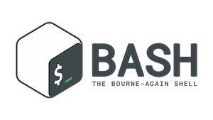

# UNIX basics and introduction to commandline tools

These lectures and resources will support learning how to use BASH and
shell scripting.

# Lectures
* [Cluster Login, UNIX Basics](00_Login_Notebook) [PDF](00_Login_Notebook.pdf)
* [Running Programs](01_Tools) [PDF](01_Tools.pdf)

